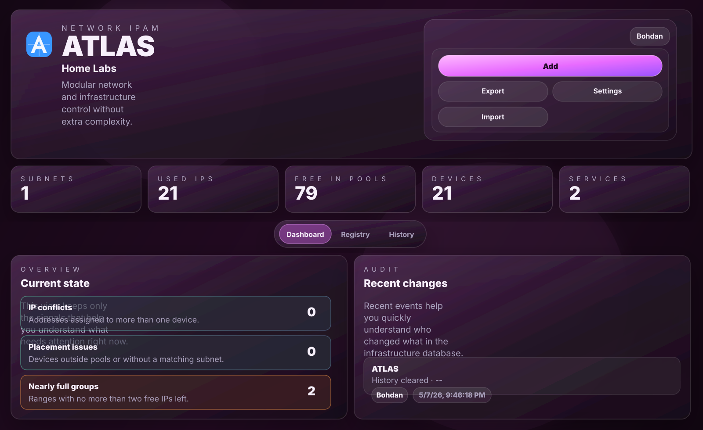

# ATLAS

Мовні версії: [English](README.md) | [Українська](README.uk.md) | [Русский](README.ru.md)

ATLAS — self-hosted IPAM і легкий реєстр мережі для home-lab, невеликих команд і внутрішніх мереж, що ростуть.



## Що робить ATLAS

- керує підмережами з `CIDR`, пулами, нотатками та, за потреби, групами доступу
- підтримує іменовані діапазони IP всередині підмережі
- зберігає пристрої з `name`, `IP`, необов'язковим `MAC`, `type` і нотатками
- підказує вільний IP на основі бази та, за потреби, `ping`
- визначає конфлікти IP
- веде історію змін IP
- підтримує багатокористувацький доступ з ролями та групами доступу
- приймає безпечні discovery snapshots від опціональних push-агентів
- імпортує й експортує дані через `JSON`, `CSV` і повний `backup`

## Швидкий старт

```bash
python3 server.py
```

Відкрити:

- `http://localhost:4173`
- `http://<server-ip>:4173`

Під час першого чистого запуску створюється bootstrap-акаунт:

- логін: `Admin`
- пароль: `Atlas`

Після першого входу пароль потрібно змінити.

## Як використовувати

Базовий сценарій:

1. Додати підмережу.
2. За потреби створити групи діапазонів усередині підмережі.
3. Додати пристрої вручну.
4. Використовувати пошук, фільтри та історію для контролю зайнятості.
5. Робити експорт або backup за потреби.

## Користувачі та доступ

- `admin` — повний доступ, користувачі, групи доступу, серверні налаштування
- `editor` — читання та запис дозволених даних
- `viewer` — лише читання

Групи доступу визначають видимість:

- підмережа може бути публічною або обмеженою групою доступу
- `admin` бачить усе
- не-адміни бачать публічні підмережі та ті, що призначені їхнім групам

## Ping і автоматизація

`ping` у ATLAS — це сигнал зайнятості, а не повноцінне мережеве виявлення.

Використовується для:

- безпечнішого підбору вільного IP
- точкової перевірки підмереж
- виявлення адрес, які вже можуть бути зайняті

Рекомендована практика:

- вмикати auto-ping лише для тих підмереж, які досяжні з сервера ATLAS
- вимикати його для віддалених або ізольованих мереж, де `ping` не дає надійного результату

## Динамічне виявлення

У v0.3 ATLAS додає опціональне discovery через push-агентів. ATLAS типово не сканує мережу:
агенти збирають локальний inventory і надсилають підписані snapshots в ATLAS.

Поточні collector'и агента:

- `host`
- `docker`
- `kubernetes`
- `proxmox`

Типово discovery працює в режимі preview. Записи створюються лише після підтвердження
або при явно ввімкненому create-on-discovery для довіреного агента.

Безпека агентів:

- token показується один раз і зберігається в ATLAS лише як hash
- snapshots перевіряються через `schemaKey`, signature, timestamp і nonce
- для агента можна обмежити allowed IP/CIDR
- definitions агентів експортуються без token-секретів

Налаштування агента описано в `agent/README.md`.

## Імпорт, експорт і backup

Підтримувані формати:

- `JSON` — знімок стану ATLAS
- `CSV` — окремі вивантаження для підмереж, діапазонів і пристроїв
- `Backup ATLAS` — повний backup для відновлення або перенесення

Якщо потрібне повне перенесення інстансу разом із користувачами, налаштуваннями та моделлю доступу, краще використовувати саме `Backup ATLAS`.

## Зберігання даних

ATLAS зберігає спільний стан у серверній `SQLite`.

- типовий шлях до бази: `data/atlas.db`
- база створюється автоматично
- до одного інстансу можуть підключатися кілька пристроїв

## Конфігурація

Змінні середовища:

- `ATLAS_HOST` — адреса прив'язки, типово `0.0.0.0`
- `ATLAS_PORT` — порт, типово `4173`
- `ATLAS_DB_PATH` — шлях до бази, типово `data/atlas.db`
- `ATLAS_SCAN_INTERVAL` — інтервал фонового сканування в секундах, типово `90`
- `ATLAS_SCAN_TIMEOUT_MS` — таймаут одного ping, типово `1000`
- `ATLAS_SCAN_CONCURRENCY` — паралельність ping, типово `32`
- `ATLAS_HISTORY_LIMIT` — кількість записів історії для UI, типово `200`
- `ATLAS_DISCOVERY_MAX_BODY_BYTES` — максимальний розмір discovery packet, типово `524288`
- `ATLAS_DISCOVERY_MAX_ITEMS` — максимум discovery items в одному packet, типово `500`
- `ATLAS_DISCOVERY_MAX_RAW_BYTES` — максимум raw metadata на об'єкт, типово `16384`

Приклад:

```bash
ATLAS_PORT=4180 python3 server.py
```

## Файли проєкту

- `index.html` — основний UI
- `styles.css` — стилі
- `app.js` — клієнтська логіка
- `server.py` — API, авторизація, статика, SQLite, сканування
- `group-suggestion-templates.json` — комплектні правила автопідстановки груп
